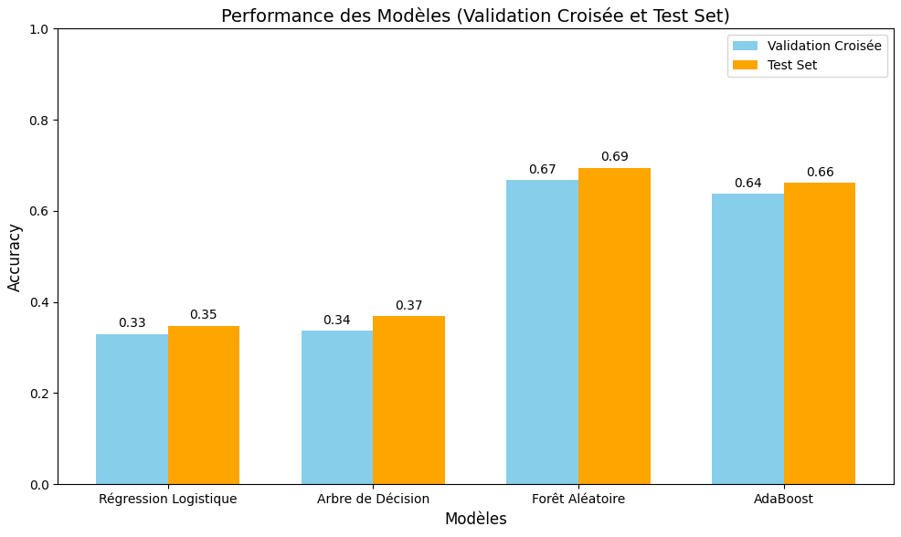
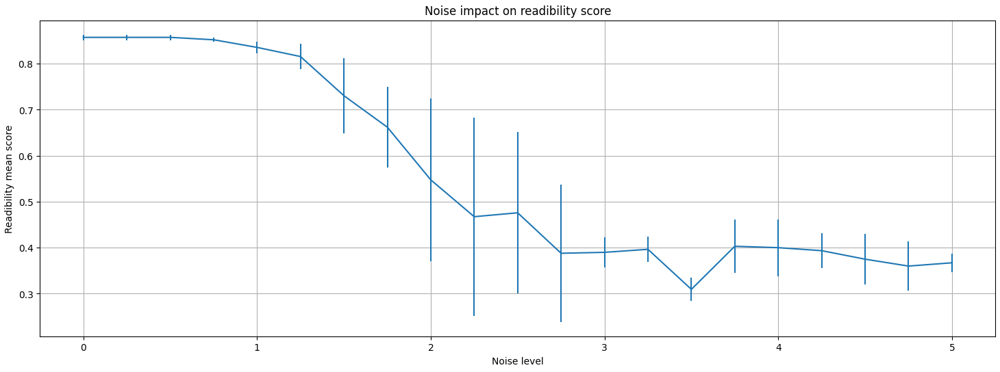

## Readability Classifier

Un pipeline complet pour évaluer la lisibilité de documents images (PNG) via segmentation et CNN.

### Présentation

Ce projet segmente chaque document en caractères, les classe avec un CNN (dataset Char74k), puis agrège les probabilités pour calculer un **score de lisibilité**.

---

### Arborescence

```plaintext
readability-classifier/
├── data/                # Char74k & exemples PNG
├── research/            # Expérimentations (notebooks)
├── pipeline/            # Code de bout en bout
│   ├── scored_outputs/  # Documents annotés
│   ├── functions.py     # Fonctions utilitaires
│   └── script.py        # Point d'entrée du pipeline
├── runs/                # Logs TensorBoard
├── requirements.txt     # Dépendances
└── README.md            # Document d'introduction
```

---

### Utilisation

```bash
python pipeline/script.py \
  --input data/docs_samples \
  --output pipeline/scored_outputs \
  --model research/models/cnn_model2.pth
```

---

### Étapes clés

1. **Exploration** (01\_limitations\_ml\_vision.ipynb)

   * Analyse des limites ML/vision
   * Exploration du jeu de données utilisé (caractères manuscrits arabes)
   * Définition d'une baseline (régression logistique)
   * Comparaison de plusieurs modèles ML
   * Conclusion sur les performances globales

   

2. **Segmentation** (02\_segmentation.ipynb)

   * Extraction pas à pas des caractères d'un document-test
   * Segmentation "from scratch"
   * TODO: Evaluation d'une méthode CCA pour améliorer la robustesse

3. **Entraînement** (03\_cnn.ipynb, 04\_vision\_transformers.ipynb)

   * Analyse rapide du jeu d'entraînement
   * Premiers tests avec CNN et ViT
   * Résultats :

   | Expérience | Modèle             | Logs TensorBoard                      | ValAcc |
   | ---------- | ------------------ | ------------------------------------- | ------ |
   | Baseline   | `baseline_cnn.pth` | `runs/baseline_train0`                | 84 %   |
   | 1          | `cnn_model1.pth`   | `runs/cnn_fromscratch_train1`         | 81 %   |
   | 2          | `cnn_model2.pth`   | `runs/cnn_fromscratch_train2`         | 88 %   |
   | 3          | `transformer0.pth` | `runs/transformer_fromscratch_train0` | 0,16 % |
   | 4          | `transformer1.pth` | `runs/transformer_fromscratch_train1` | 69 %   |
   | 5          | `transformer2.pth` | `runs/transformer_fromscratch_train2` | 54 %   |

   Le meilleur modèle retenu est `cnn_model2.pth` (88 % d'exactitude sur dataset de test).

4. **Scoring** (05\_scoring\_documents.ipynb)

   * Utilisation des fonctions développées pour extraire les caractères et récupérer les probabilités maximales de classification
   * Agrégation de ces scores par document pour obtenir le score de lisibilité
   * Étude de faisabilité : ajout progressif de bruit aux documents et mesure de l'évolution du score de confiance

   

   **Observations** : corrélation négative nette entre le niveau de bruit et le score de lisibilité. Toutefois, certaines anomalies montrent un manque de pouvoir discriminant pour séparer clairement tous les cas.

---

### Lancement de TensorBoard

```bash
tensorboard --logdir runs/
```
